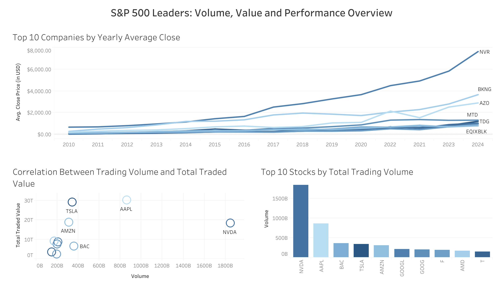
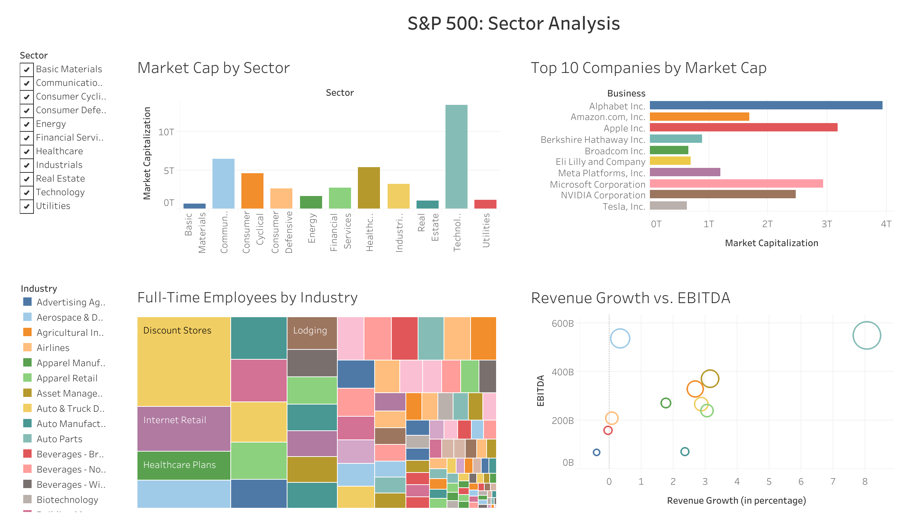
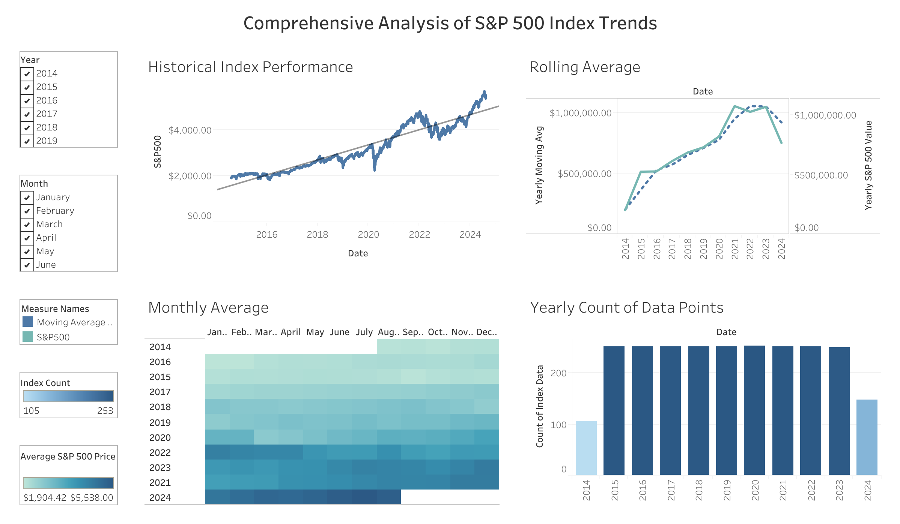

# S&P 500 Analysis (2010 - 2024)

## Project Overview

This project provides a comprehensive analysis of the S&P 500, focusing on key metrics such as market capitalization, trading volume and performance trends from 2010 - 2024.

---

## Technical Stack

| Stage          | Tool                                   |
|----------------|----------------------------------------|
| Data cleaning  | Python (in VS Code)                    |
| Dashboards     | Tableau Public                         |

---

## Data Sources

- **S&P 500 Historical Data**: Stock prices, market capitalization, and other financial metrics.
- **Sector and Industry Data**: Company classifications within the index.
- **Kaggle**: The datasets were retrieved from [Kaggle](https://www.kaggle.com/datasets/andrewmvd/sp-500-stocks)

---

## Tableau Dashboards

1. **[S&P 500 Leaders: Volume, Value and Performance Overview](https://public.tableau.com/views/StockProjectLeadersOverview/SP500LeadersVolumeValueandPerformanceOverview?:language=en-US&publish=yes&:sid=&:redirect=auth&:display_count=n&:origin=viz_share_link)**
   - Highlights yearly average closing prices, trading volume and total traded value of leading companies.
  
  
2. **[S&P 500: Sector Analysis](https://public.tableau.com/shared/26Q2SZCQX?:display_count=n&:origin=viz_share_link)**
   - Provides a detailed examination of market capitalization across sectors, highlights workforce distribution by industry and identifies the leading companies based on market capitalization.
  
3. **[Comprehensive Analysis of S&P 500 Index Trends](https://public.tableau.com/views/StockProjectIndexTrends/ComprehensiveAnalysisofSP500IndexTrends?:language=en-US&publish=yes&:sid=&:redirect=auth&:display_count=n&:origin=viz_share_link)**
   - Displays an in-depth look at historical index performance, including rolling averages, monthly trends and the distribution of data points over time for clarity.

---

## Dashboard Previews

### Leaders Overview

### Sector Analysis

### Index Trends

---

## Key Findings

- **Tech Dominance:** Sector now exceeds 30% of total index market cap.
- **Energy Decline:** Sector share dropped from 12% to 4% over the period.
- **High-turnover Outliers:** NVDA and TSLA trade at over 2x the median daily volume.
- **2020-21 Post-Pandemic Surge:** Index surged as large-cap tech stocks regained momentum.
- **EBITDA Leaders:** Tech and Healthcare sectors consistently convert growth into earnings.

---

## Repository Structure

- /data/     → Raw and cleaned CSV/XLSX  
- /scripts/  → data_load.py and data_processing.py  
- /img/      → Dashboard preview PNGs  
- /README.md → Project overview (this file)

